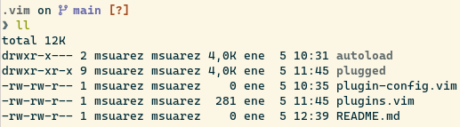

# VIM DOTFILES

This is an easy installation of vim configuration. Not for use VIM as a main editor, just to be functional.
Do not underestimate this configuration. It has autocomplete, highlight syntax, status bar at bottom etc.

## Prerequisites

First of all its important to paste the next content in your .vimrc:

~~~vim
    syntax enable
    syntax on

    set fileformat=unix
    set encoding=UTF-8

    set nocompatible
    set history=1000
    let &t_ut=''
    set nobackup
    set nowritebackup
    set noswapfile
    au BufNewFile,BufRead *.py
        \ set tabstop=4 |
        \ set softtabstop=4 |
        \ set shiftwidth=4 |
    set autoindent " autoindent always ON.
    set expandtab " expand tabs
    set shiftwidth=2 " spaces for autoindenting
    set softtabstop=2 " remove a full pseudo-TAB when i press <BS>
    set lazyredraw
    set ttyfast
    set showmatch      " higlight matching parentheses and brackets
    set wildmenu       " enable visual wildmenu
    set nohlsearch     " clear highlight after a search
    set scrolloff=8
    set showcmd
    "set noshowmode

    set ignorecase
    set smartcase
    set incsearch
    set hlsearch
    nnoremap <CR> :noh<CR><CR>:<backspace>

    set conceallevel=1
    set shortmess+=c
    set formatoptions-=cro
    set number relativenumber

    so ~/.vim/plugins.vim
    so ~/.vim/plugin-config.vim

    set termguicolors
    set background=light
    colorscheme solarized
    hi Normal guibg=NONE ctermbg=NONE
    let g:terminal_ansi_colors = [
        \ '#282828', '#cc241d', '#98971a', '#d79921', '#458588', '#b16286', '#689d6a', '#a89984',
        \ '#928374', '#fb4934', '#b8bb26', '#fabd2f', '#83a598', '#d3869b', '#8ec07c', '#ebdbb2',
    \]
~~~

## Instalation

Once this is done you can clone the repo in your **/.vim** folder.
The structure might have to be like this:

Now you only have to install all the plugins with the **:PlugInstall** command inside of vim and remember to execute **:source %**. Finally, for the CoC plugin, install the differents languages that you will use fot the autocomplete and suggestions, for example:

~~~vim
:CocInstall coc-tsserver coc-tabnine coc-pyright coc-html coc-css
~~~

Feel free to update the configuration or plugins.

## Structure

### autoload

A template that comes with Plug manager.

### plugged

You will find the source code of all plugins installed.

### plugin-config.vim

An empty file to put all your plugins configuration.

### plugins.vim

All the plugins that are going to be installed with the Plug manager. For example:

~~~vim
Plug 'ericbn/vim-solarized'
Plug 'vim-airline/vim-airline'
~~~
